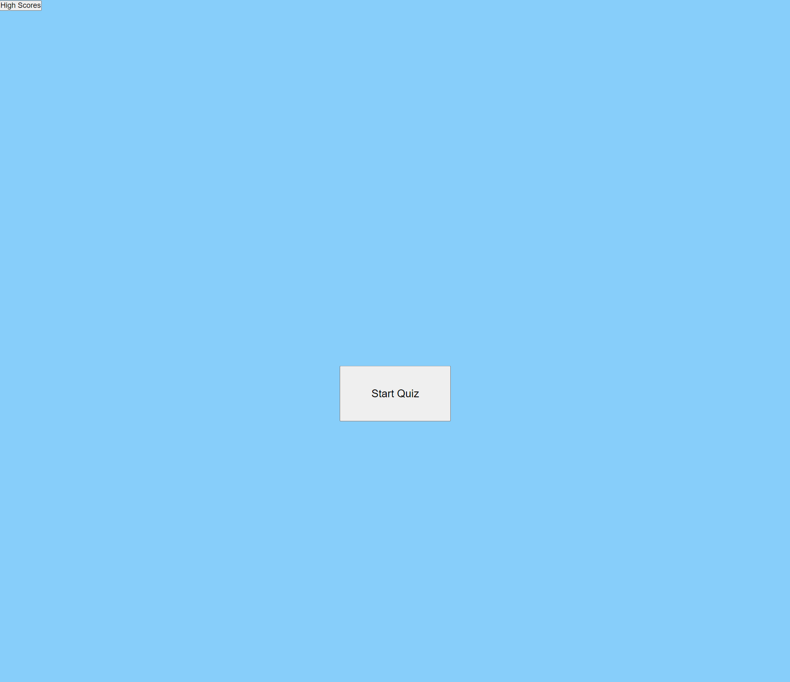

# project-code-quiz
A repository to hold the source code to  code quiz application. My deployed application may be viewed through the section titled ## Deployed application link. 

## Motivation
This project exists to showcase my ability to utilize JavaScript, html, and CSS to create a multiple choice quiz with dynamic functionality.

## Screenshots

Below are screenshot examples of the application, and it's functionality:

## Tech/framework used
JavaScript, HTML, and CSS

## Deployed application link

Deplyed application: 

## How to use?
Open the deployed application to begin. To view a list of high scores from the game, click the button in the top left titled 'High Scores.' To start the quiz, click the Start Quiz button.

Answer the questions by clicking an option, and correctly doing so will increase your score; if your answer selection is not correct, your time (top right) will further decrease. Once you answer all the questions or your time runs out, input your initals to save your score. Replay game to refresh the application.

## License

MIT © [nicanthoni]()
